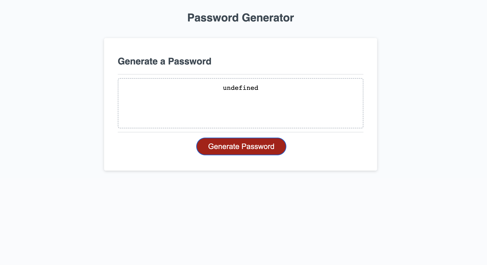

# Challenge Three: Password Generator Starter Code

## User Story

For this challenge, I will modify the existing code using the acceptance criteria requirements to create an application that allows the user to generate a random password to provide better security. 

# Acceptance Criteria

The following is a list of requirements for the new code:
- When the user cicks the button to create a password, the user will be presented with prompts for password criteria. 
- The user will be able to select the criteria in the prompt and use it to make a password. 
- The password length should be between 8 and 128 characters in long. 
- The password must contain at least one of the following: lowercase, uppercase, numeric, and/or special characters. 
- When all criteria is met, the password will be generated and ready to use.
- When the password is generated, the user will be alerted. 

Link to deployment:

